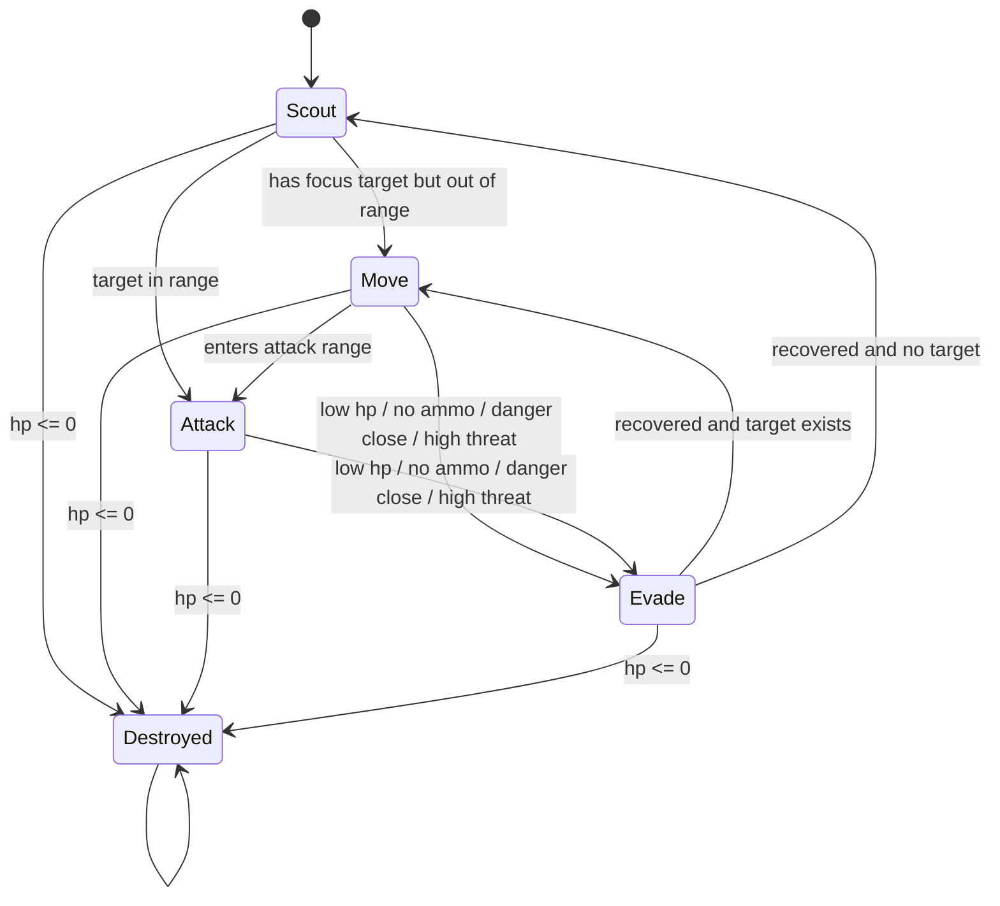
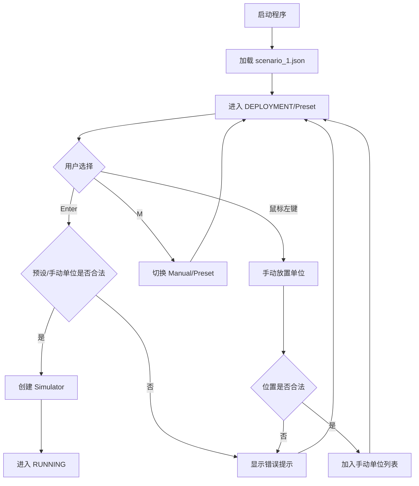
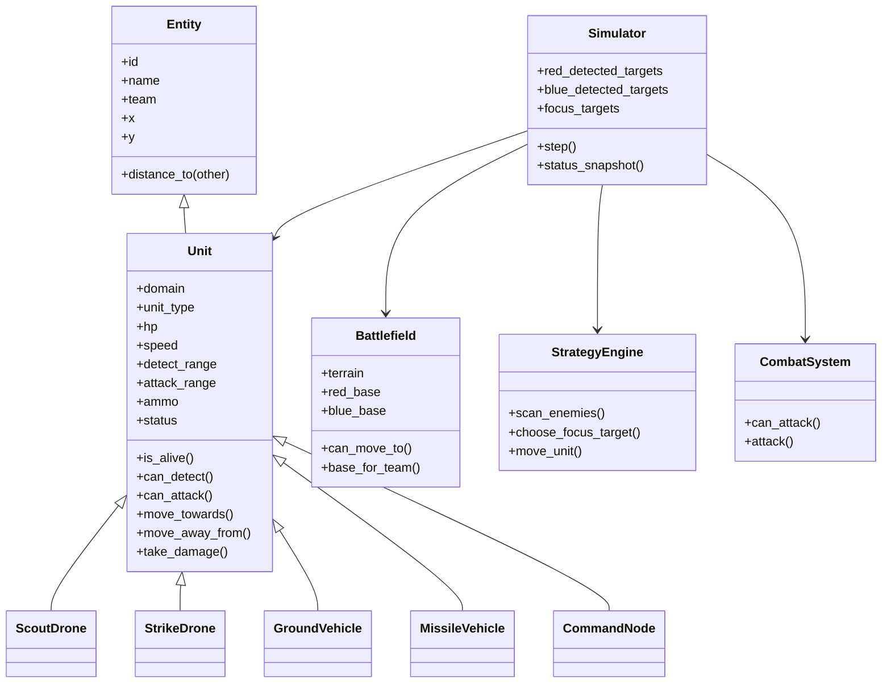
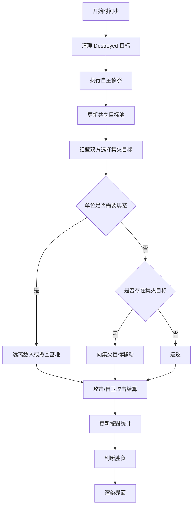
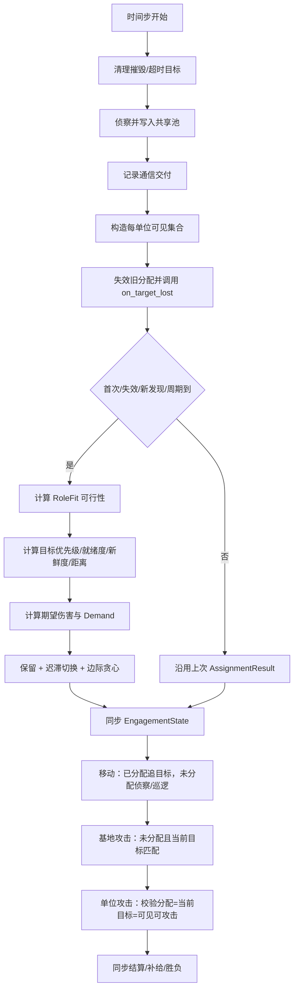

# 详细设计

## Battlefield 类设计

`Battlefield` 表示二维战场，包含宽度、高度、地形、红蓝基地和障碍物列表。

- `can_move_to(x, y, unit_or_domain="ground")`：判断目标点是否在地图内，且未被该单位不可通行的障碍物覆盖；只传 `"ground"` 时沿用旧规则（任何障碍物都阻挡）。
- `obstacles_at(x, y)`：返回覆盖指定坐标的全部障碍物。
- `base_for_team(team)`：返回指定阵营基地坐标。
- `Obstacle`：包含 `name`、`type`、`x`、`y`、`width`、`height`。

## Unit 类设计

`Unit` 继承 `Entity`，封装通用单位属性和移动行为。

- 属性：`id`、`name`、`team`、`domain`、`unit_type`、`x`、`y`、`hp`、`max_hp`、`speed`、`detect_range`、`attack_range`、`attack_power`、`ammo`、`status`。
- 预留能力：`can_attack_air`、`can_attack_ground`。
- 方法：`is_alive()`、`can_detect()`、`can_attack()`、`move_towards()`、`move_away_from()`、`patrol()`、`take_damage()`。
- 子类：`ScoutDrone`、`StrikeDrone`、`GroundVehicle`、`MissileVehicle`、`CommandNode`。

## 兵种类设计

- `ScoutDrone`：domain 为 air，unit_type 为 scout_drone，高速、高侦察、低攻击。
- `StrikeDrone`：domain 为 air，unit_type 为 strike_drone，中速、中攻击，适合协同打击。
- `GroundVehicle`：domain 为 ground，unit_type 为 ground_vehicle，低速、高生命、高攻击。
- `MissileVehicle`：domain 为 ground，unit_type 为 missile_vehicle，远程、高伤害、低弹药。
- `CommandNode`：domain 为 command，unit_type 为 command_node，不移动，生命值较高。

## 空地移动差异

空中单位调用 `try_move()` 时只检查地图边界，因此可以越过普通障碍物。地面单位调用 `try_move()` 时需要通过 `battlefield.can_move_to()`，默认不能进入障碍物；`ground_vehicle` 与 `missile_vehicle` 可按 `data/unit_config.json` 的 `terrain_effects` 进入山地/建筑，但会减速并降低命中率（见下一节）。指挥节点 domain 为 command，移动方法直接返回。

## 山地/建筑通行与地形修正（2026-11-15）

地面兵种是否可进入山地/建筑，以及进入后的速度与命中修正，全部由 `data/unit_config.json` 的 `terrain_effects` 决定；`config.py` 的 `OBSTACLE_TYPES = ("obstacle", "mountain", "building", "restricted")` 是唯一的地形类型白名单，场景加载校验也复用它。

```json
"ground_vehicle": {
  "terrain_effects": {
    "mountain": {"speed_factor": 0.55, "attack_hit_factor": 0.75, "cover_hit_factor": 0.80},
    "building": {"speed_factor": 0.70, "attack_hit_factor": 0.70, "cover_hit_factor": 0.60}
  }
}
```

- **可通行性**：`terrain_effects` 是白名单。列出的地形可进入，未列出的（如 `restricted`、默认 `obstacle`）仍然阻挡。删除整项即可恢复“不可进入”。
- **移动减速**：`Unit.effective_speed()` 返回 `speed × speed_factor`；`move_towards`、`move_away_from`、`patrol` 与 `core/pathfinding.py` 的步长/探测距离都用它，单位通过山地/建筑时每步走得更短。
- **命中修正**：`attack_hit_factor` 作用于身处该地形的攻击方，`cover_hit_factor` 作用于身处该地形的目标；两者与距离、目标速度、规避、视线遮挡因子相乘，最终仍限制在 `[0.05, 0.95]`。
- **避免重复惩罚**：计算视线掩体时，若攻击方或目标位于其可通行的地形内，该地形不再额外触发 0.3 遮挡因子；地形影响由上述两个倍率单独表达。
- **重叠地形**：`Unit.terrain_factor()` 取所有覆盖该点且已配置地形中最强的（最小）倍率。
- **配置校验**：`get_terrain_effects()` 忽略未知地形类型和非数值/越界倍率（`0~1`，`speed_factor` 必须 `>0`），回退为 1.0 并只警告一次；返回值是副本，修改不会污染缓存。
- **部署与地图编辑**：地面单位可直接部署/拖入其可通行地形；空中单位保持既有规则（部署时不能放在障碍物上）；`restricted` 仍阻挡一切地面单位。创建/拖动/缩放障碍物覆盖可通行该地形的单位时不再判定冲突。
- **界面**：单位详情显示当前地形、速度倍率与攻击/受击命中倍率，数据来自 `controller._terrain_snapshot()`。

## UnitFactory 设计

`core/unit_factory.py` 维护兵种注册表：

```text
scout_drone -> ScoutDrone
strike_drone -> StrikeDrone
ground_vehicle -> GroundVehicle
missile_vehicle -> MissileVehicle
command_node -> CommandNode
```

## 第六阶段：协同打击与战术规避增强

### 目标池设计

第六阶段新增 `core/target_pool.py`，用 `TargetPool` 规范红蓝双方共享目标池。`Simulator.shared_targets` 保存两个阵营的目标池，`red_detected_targets` 和 `blue_detected_targets` 作为明确命名的访问入口。

目标池中的每条记录为：

```text
TargetSighting:
    target: Unit
    last_seen_step: int
```

侦察单位在 `Simulator._reconnaissance_phase()` 中发现敌人后调用 `TargetPool.sight(target, time_step)`，首次发现写入 `[Scout]` 和 `[TargetPool]` 日志，再次发现刷新 `last_seen_step`。每个时间步调用 `cleanup()` 清理已摧毁目标和超过 `DETECTION_TIMEOUT_STEPS` 未再次发现的目标。

### 协同打击伪代码

```text
for each step:
    cleanup destroyed or stale targets
    for each active unit:
        scan enemies in detect_range
        add or refresh sightings in own team's detected_targets

    for each team:
        old_focus = focus_target
        focus_target = choose_focus_target(detected_targets, active friendly units)
        if focus changed:
            add [Focus] log

    for each active unit:
        if unit should evade:
            state = Evade
            move away from nearest enemy or retreat to base
        else if focus_target exists:
            if target in attack_range:
                state = Attack
            else:
                state = Move
                move toward focus_target according to unit role
        else:
            state = Scout or Move
            patrol / advance
```

### focus_target 选择算法

```text
function choose_focus_target(shared_targets, friendly_units):
    candidates = targets where target.status != Destroyed
    avg_position = average position of friendly_units
    sort by:
        target.hp ascending
        target.threat_value descending
        distance(target, avg_position) ascending
    return first target or None
```

威胁值配置：

| 兵种 | 威胁值 |
| --- | --- |
| ScoutDrone | 2 |
| StrikeDrone | 4 |
| GroundVehicle | 5 |
| MissileVehicle | 6 |
| CommandNode | 8 |

### 规避算法伪代码

```text
function should_evade(unit, nearest_enemy):
    if unit is Destroyed or unit.speed <= 0:
        return False

    danger_distance = max(50, nearest_enemy.attack_range * 0.5)

    if hp / max_hp < 0.3:
        return True
    if ammo == 0:
        return True
    if distance(unit, nearest_enemy) < danger_distance:
        return True
    if nearest_enemy.threat_value >= unit.threat_value + 3
       and distance(unit, nearest_enemy) <= nearest_enemy.attack_range:
        return True

    return False
```

规避移动：

```text
if visible nearest enemy exists:
    move away from nearest visible enemy
else:
    move toward own base

ground unit: try_move() checks obstacles
air unit: only map bounds are checked
```

### 状态机说明

单位状态规范为 `Scout`、`Move`、`Attack`、`Evade`、`Destroyed`。`Destroyed` 是终止状态，不参与移动和攻击。`Evade` 状态下允许近距离自卫攻击，但攻击后仍保持 `Evade`，避免自卫行为破坏状态机语义。


```mermaid
stateDiagram-v2
    [*] --> Scout
    Scout --> Move: has focus target but out of range
    Scout --> Attack: target in range
    Move --> Attack: enters attack range
    Move --> Evade: low hp / no ammo / danger close / high threat
    Attack --> Evade: low hp / no ammo / danger close / high threat
    Evade --> Move: recovered and target exists
    Evade --> Scout: recovered and no target
    Scout --> Destroyed: hp <= 0
    Move --> Destroyed: hp <= 0
    Attack --> Destroyed: hp <= 0
    Evade --> Destroyed: hp <= 0
    Destroyed --> Destroyed
```

### UI 显示增强

右侧信息面板显示红蓝发现目标数、红蓝当前集火目标、红蓝规避单位数量和规避单位名称。地图上每个单位继续显示当前状态文字，最近日志中会出现 `[TargetPool]`、`[Focus]`、`[Evade]`、`[Attack]` 和 `[Destroyed]`。

`scenario_loader.py` 通过 `UnitFactory.create()` 创建单位。未知 `unit_type` 会抛出 `ValueError`，便于定位场景文件错误。

## DeploymentManager 类设计

`DeploymentManager` 位于 `core/deployment.py`，负责仿真开始前的部署逻辑。

主要属性：

- `mode`：部署模式，支持 preset 和 manual。
- `selected_team`：当前选择阵营。
- `selected_unit_type`：当前选择兵种。
- `manual_units`：手动部署单位列表。
- `last_message`：最近一次提示或错误信息。

主要方法：

- `toggle_mode()`：切换预设/手动部署。
- `toggle_team()`：切换 red / blue。
- `select_unit_type()`：选择当前兵种。
- `place_unit()`：检查合法性并放置单位。
- `undo()`：撤销最近一次部署。
- `clear_manual()`：清空手动部署。
- `finalize()`：校验红蓝双方单位并返回最终单位列表。

## 部署流程活动图


```mermaid
flowchart TD
    A[启动程序] --> B[加载 scenario_1.json]
    B --> C[进入 DEPLOYMENT/Preset]
    C --> D{用户选择}
    D -- Enter --> E{预设/手动单位是否合法}
    E -- 是 --> F[创建 Simulator]
    F --> G[进入 RUNNING]
    E -- 否 --> H[显示错误提示]
    D -- M --> I[切换 Manual/Preset]
    I --> C
    D -- 鼠标左键 --> J[手动放置单位]
    J --> K{位置是否合法}
    K -- 是 --> L[加入手动单位列表]
    K -- 否 --> H
    L --> C
    H --> C
```

## Simulator 类设计

`Simulator` 维护仿真状态：

- `red_detected_targets`：红方发现目标池。
- `blue_detected_targets`：蓝方发现目标池。
- `focus_targets`：红蓝双方当前集火目标。
- `destroyed_count`：红蓝双方损失统计。
- `kill_count`：红蓝双方击毁敌方数量。
- `attack_count`：红蓝双方发起攻击次数。
- `total_damage`：红蓝双方造成的实际总伤害。
- `combat_logs`：最近 8 条战斗日志。
- `attack_events`：攻击连线特效事件。

`step()` 中集中实现单时间步流程，便于测试和答辩说明。

## CombatSystem 设计

`core/combat.py` 中的 `CombatSystem` 负责统一攻击结算，避免攻击规则分散在仿真器、策略和界面中。

主要接口：

- `can_attack(attacker, target)`：调用单位能力接口，判断攻击者、目标、弹药、射程和平台攻击能力。
- `attack(attacker, target)`：执行弹药消耗、状态切换、伤害扣除，并返回 `AttackEvent`。

`AttackEvent` 包含攻击者、目标、起点、终点、实际伤害、目标剩余生命、目标是否被摧毁和特效剩余帧数。渲染器用它绘制攻击连线和命中标记，仿真器用它累计统计。

## 侦察算法设计

```text
for each active unit:
    enemies = active enemy units
    for each enemy:
        if enemy is not Destroyed and distance(unit, enemy) <= unit.detect_range:
            add enemy to shared target pool of unit.team
            print Scout log when newly discovered
```

特点：

- 被摧毁目标不会加入目标池。
- 每个时间步清理 Destroyed 目标。
- 界面显示探测范围和发现目标数。

## 协同集火目标选择算法

```text
function choose_focus_target(shared_targets, friendly_units):
    candidates = all not destroyed shared targets
    avg_position = average position of friendly units
    sort by:
        target.hp ascending
        distance(target, avg_position) ascending
    return first target
```

该规则简单清晰，能体现“共享目标池”和“集中火力”的协同思想。

## 规避算法设计

```text
function should_evade(unit):
    if unit.speed <= 0:
        return False
    if hp / max_hp < 0.3:
        return True
    if ammo == 0:
        return True
    if nearest_enemy_distance < attack_range * 0.5:
        return True
```

```text
function evade_move(unit):
    if visible enemy exists:
        move away from nearest visible enemy
    else:
        move toward own base
```

Evade 状态下单位不会追击集火目标，但若最近敌人非常近，攻击阶段允许自卫攻击。

## 攻击结算算法

```text
function attack(attacker, target):
    if attacker is Destroyed:
        return None
    if target is Destroyed:
        return None
    if attacker.ammo <= 0:
        return None
    if distance(attacker, target) > attacker.attack_range:
        return None
    if target.domain == air and not attacker.can_attack_air:
        return None
    if target.domain in [ground, command] and not attacker.can_attack_ground:
        return None

    attacker.ammo -= 1
    attacker.status = Attack
    actual_damage = target.take_damage(attacker.attack_power)
    return AttackEvent(actual_damage, target.hp, target.is_destroyed)
```

## 胜负判断算法

所有未摧毁单位均为有效单位，`CommandNode` 不单独作为失败条件；基地被摧毁或一方单位全灭都会立即结束对局。达到步数上限时不再无条件判平，而是按剩余战力裁定。

```text
function judge_winner():
    red_alive  = count(red units where status != Destroyed)
    blue_alive = count(blue units where status != Destroyed)

    if (red_alive == 0 or red_base_destroyed)
       and (blue_alive == 0 or blue_base_destroyed):
        winner = draw; reason = base_destroyed or elimination
    else if red_alive == 0 or red_base_destroyed:
        winner = blue; reason = base_destroyed or elimination
    else if blue_alive == 0 or blue_base_destroyed:
        winner = red;  reason = base_destroyed or elimination
    else if time_step >= max_steps:
        winner = step_limit_verdict()   # 见下；持平返回 draw
        reason = step_limit

function step_limit_verdict():
    # 依次比较，任一项分出高低即返回胜方
    1. 剩余战力 team_strength(alive units)
    2. 敌方基地剩余血量比例（越低越好）
    3. 存活单位数
    三项完全相同 -> draw
```

`step_limit_verdict()` 使用结算当步的实时存活快照，避免使用本步开始时缓存的旧战力。默认上限为 1200 步，可在界面中配置为 1–10,000。

## 可视化设计

`Renderer` 绘制地图、基地、障碍物、探测范围、攻击连线、单位图标、血条和状态文字。

`InfoPanel` 显示时间步、运行状态、剩余单位、摧毁数量、发现目标数、集火目标和胜负结果。

## Mermaid 类图


```mermaid
classDiagram
    class Entity {
        +id
        +name
        +team
        +x
        +y
        +distance_to(other)
    }
    class Unit {
        +domain
        +unit_type
        +hp
        +speed
        +detect_range
        +attack_range
        +ammo
        +status
        +is_alive()
        +can_detect()
        +can_attack()
        +move_towards()
        +move_away_from()
        +take_damage()
    }
    class ScoutDrone
    class StrikeDrone
    class GroundVehicle
    class MissileVehicle
    class CommandNode
    class Battlefield {
        +terrain
        +red_base
        +blue_base
        +can_move_to()
        +base_for_team()
    }
    class Simulator {
        +red_detected_targets
        +blue_detected_targets
        +focus_targets
        +step()
        +status_snapshot()
    }
    class StrategyEngine {
        +scan_enemies()
        +choose_focus_target()
        +move_unit()
    }
    class CombatSystem {
        +can_attack()
        +attack()
    }
    Entity <|-- Unit
    Unit <|-- ScoutDrone
    Unit <|-- StrikeDrone
    Unit <|-- GroundVehicle
    Unit <|-- MissileVehicle
    Unit <|-- CommandNode
    Simulator --> Battlefield
    Simulator --> StrategyEngine
    Simulator --> CombatSystem
    Simulator --> Unit
```

## Mermaid 活动图


```mermaid
flowchart TD
    A[开始时间步] --> B[清理 Destroyed 目标]
    B --> C[执行自主侦察]
    C --> D[更新共享目标池]
    D --> E[红蓝双方选择集火目标]
    E --> F{单位是否需要规避}
    F -- 是 --> G[远离敌人或撤回基地]
    F -- 否 --> H{是否存在集火目标}
    H -- 是 --> I[向集火目标移动]
    H -- 否 --> J[巡逻]
    G --> K[攻击/自卫攻击结算]
    I --> K
    J --> K
    K --> L[更新摧毁统计]
    L --> M[判断胜负]
    M --> N[渲染界面]
```

## 协同动态边际拍卖（RDMA，2026-11-15）

### 目标与边界

原机制由阵营共享目标池选出一个 `focus_target`，所有可用单位向它移动和攻击。它能形成集火，但无法表达“哪个单位更适合打哪个目标”“一个目标需要几个单位”“换目标是否值得”等问题。RDMA（Role-aware Dynamic Marginal Auction）把这一步改为显式的“单位 → 目标”分配：

- 每个单位最多一个主分配目标；一个目标可被多个单位承担，但不超过 Demand 和配置上限。
- `RoleFit` 由 `unit_type × target_type` 配置驱动，`Unit.can_engage()` 是硬约束；射程只决定何时能开火，不阻止提前分配和接近。
- 未分配单位不再回退 `focus_target` 或最近敌人进行普通攻击，只执行侦察/巡逻；紧急自卫仍走原有行为逻辑。
- 基地不进入 RDMA v1 候选集，继续使用既有基地攻击通道；`focus_targets` 保留给界面和旧路径兼容。
- 同步攻击结算、`SEARCH → REACTING → ATTACK → COOLDOWN` 状态机、规避和回放/日志语义保持不变。

### 数据结构

`core/cooperative_allocator.py` 的 `AssignmentResult` 保存一次分配的完整快照：

| 字段 | 含义 |
| --- | --- |
| `assignments` | `unit_id -> target_id`，每单位最多一项 |
| `target_members` | `target_id -> [unit_id]`，按 ID 排序 |
| `primary_target_id` | 成员数最多、目标优先级最高、ID 最小的主目标 |
| `updated_step` | 本次分配对应的仿真步 |
| `assignment_since` | 每个单位当前分配的起始步，用于迟滞和日志 |
| `reasons` | `retained / switch / new`，用于可解释性 |
| `demand` | 每个目标的期望成员上限 |

`Simulator.assignments[team]` 保存两阵营最近一次结果；`_assignment_ready_step[team]` 标记“本步已经跑过 RDMA”。只有该标记等于当前步时，移动和攻击阶段才使用分配授权；直接调用旧阶段方法的兼容代码不会设置该标记，因此自动回退到旧目标选择。

### 配置

配置位于 `data/unit_config.json` 的 `cooperative_assignment`，缺省值在 `config.py` 的 `COOPERATIVE_ASSIGNMENT_DEFAULTS`。`core/unit_config_loader.py` 负责深合并、类型校验和回退；非法值发出一次 `RuntimeWarning` 后使用默认值。

| 配置 | 作用 |
| --- | --- |
| `enabled` | 是否启用 RDMA；关闭时旧目标选择逐字保留 |
| `replan_interval_steps` | 常规重规划周期 |
| `max_assignments_per_target` | 单目标成员硬上限 |
| `min_assignment_bid` | 低于该出价不分配 |
| `switch_penalty` | 旧目标仍可行时改选其他目标的出价惩罚 |
| `reassign_margin` | 迟滞换目标所需的最小收益差 |
| `overload_penalty` | 目标接近 Demand 时的边际惩罚 |
| `demand_horizon_steps` | Demand 估计的射击窗口 |
| `target_priority_weights` | 目标类型威胁与低血量权重 |
| `unit_readiness_weights` | 单位生命与弹药权重 |
| `bid_weights` | 目标优先级、RoleFit、就绪度、新鲜度、距离成本权重 |
| `role_fit` | `attacker_type -> target_type -> [0,1]` 适配矩阵 |

### RoleFit 与硬约束

对单位 `i`、目标 `j`：

```text
RoleFit(i, j) = role_fit[unit_type_i][target_type_j]
```

若 `not unit.can_engage(target)`，该单位-目标对不进入候选集，不参与出价和 Demand。`can_engage()` 只检查存活、弹药、攻击力、对空/对地域限制；`can_attack()` 在此基础上再检查距离。这样单位可以被分配到一个尚未进入射程的目标，接近后由攻击阶段按 `can_attack()` 授权。

### 出价

目标优先级：

```text
P_j = w_type * norm(threat_value_j) + w_lowHP * (1 - hp_ratio_j)
```

单位就绪度：

```text
R_i = w_health * hp_ratio_i + w_ammo * (ammo_i / max_ammo_i)
```

信息新鲜度与距离成本：

```text
F_ij = max(0, 1 - age_j / DETECTION_TIMEOUT_STEPS)
D_ij = min(1, distance(i, j) / battlefield_diagonal)
```

出价：

```text
B_ij = w_tp * P_j + w_rf * RoleFit(i, j) + w_r * R_i
     + w_f * F_ij - w_d * D_ij
     - switch_penalty * [old_target_i exists, still feasible, and != j]
```

出价只用于排序和保留/切换判断；不直接决定伤害，伤害仍由 `CombatSystem` 同步结算。

### Demand：期望伤害覆盖

对每个“单位-目标”对估计窗口内期望伤害：

```text
E_ij = p_hit(i, j, battlefield) * attack_power_i
       * (1 + CRIT_CHANCE * (CRIT_DAMAGE_MULTIPLIER - 1))
       * shots_i(H)
```

`p_hit` 直接复用 `core.combat.calculate_hit_probability()`，因此自动包含距离、速度、掩体和规避因子；暴击按期望值折算。`shots_i(H)` 从 `EngagementState` 的当前阶段和进度计算：

```text
cycle = max(1, reaction_delay + attack_cooldown + 1)

ATTACK:    ready_in = 0
REACTING:  ready_in = max(0, reaction_delay - reaction_progress)
COOLDOWN:  ready_in = max(0, attack_cooldown - cooldown_progress) + reaction_delay
SEARCH:    ready_in = reaction_delay

shots = 0                         if ready_in >= H
      = 1 + (H - 1 - ready_in)//cycle  otherwise
```

Demand 把同一目标的 `E_ij` 从大到小累加，直到覆盖 `target.hp`，再取 `max(k, MIN_ASSIGNMENT_DEMAND)`，并受 `max_assignments_per_target` 和可行单位数限制。若本窗口所有可行对的期望伤害都为 0（例如全部仍在长冷却），仍保留最低需求 1，避免“无人接单”导致分配停摆，同时不把所有单位压到同一目标上。

### 选择：保留、迟滞与边际贪心

1. **保留**：旧分配仍可行且出价不低于 `min_assignment_bid` 时，在 Demand 容量内优先保留，`reasons=retained`。
2. **迟滞换目标**：只有新目标出价比旧目标高出 `reassign_margin`，且新目标仍有容量时才切换，`reasons=switch`。
3. **贪心补充**：未分配单位按 `bid - overload_penalty * count/Demand` 的边际收益选择目标，`reasons=new`；达到 Demand 的目标不再接收新单位。
4. **清理**：最后移除低于最低出价的保留项，避免旧目标已不可行时留下幽灵分配。

所有集合按 `unit_id`、`target_id` 排序；贪心和主目标使用固定键 `(-marginal, -priority, unit_id, target_id)` 等确定性规则。输入列表顺序不同不会改变结果。

### 与交战状态机同步

分配结果写入后，`Simulator` 对每个单位执行：

- 旧目标被摧毁、超时、不可见、不可交战或单位进入 `Evade`：调用 `on_target_lost()`，反应/攻击阶段回到 `SEARCH`。
- 新分配目标与 `EngagementState.current_target_id` 不同：调用 `on_assignment_changed(new_target_id)`。
  - 旧反应进度清零，新目标从 `REACTING` 的第 0 步开始，不继承旧进度。
  - 若当前处于 `COOLDOWN`，冷却进度保留，且先清空旧目标；冷却结束后由下一次分配或正常搜索重新授权，避免换目标立即开火。
  - 反应延迟为 0 时直接进入 `ATTACK`。
- 刚同步的步不推进 `tick()`，防止新目标在同步当步就多走一格反应进度。
- 攻击阶段必须同时满足：`assigned_target_id(unit)` 存在、`EngagementState.current_target_id == assigned_target_id`、目标可见且 `can_attack()`。任一条件不满足都不开火。

### 逐单位可见性

每个单位的可见集合为：

```text
Visible_i = own_sightings_i ∪ delivered_shared_targets_team(i)
```

`own_sightings_i` 是本单位当步侦察结果；`delivered_shared_targets` 是 `TargetPool.values_available(time_step)` 中通信延迟已过的目标。分配器对每个单位单独传入该集合，绝不使用“全队所有已发现目标”的并集。未收到通信的单位不会获得队友私有侦察；目标超时后由 `TargetPool.cleanup()` 在分配前移除。

### 未分配单位与基地

RDMA 启用时：

- 已分配单位只攻击分配目标；分配目标不可见/不可攻击时保持搜索或接近，不切换到 `focus_target` 或最近敌人。
- 未分配单位只侦察/巡逻，普通攻击候选为空；基地附近的紧急自卫仍可触发，并需满足 `EngagementState.current_target_id == 基地 ID`。
- 已分配单位不参与基地攻击；基地不进入 RDMA 候选集。这样基地仍由原有通道处理，不会被分配器无意“接管”。
- 进入 `Evade` 的单位释放分配；规避期间的自卫攻击仍按旧逻辑执行。

### 流程


```mermaid
flowchart TD
    A[时间步开始] --> B[清理摧毁/超时目标]
    B --> C[侦察并写入共享池]
    C --> D[记录通信交付]
    D --> E[构造每单位可见集合]
    E --> F[失效旧分配并调用 on_target_lost]
    F --> G{首次/失效/新发现/周期到}
    G -- 否 --> H[沿用上次 AssignmentResult]
    G -- 是 --> I[计算 RoleFit 可行性]
    I --> J[计算目标优先级/就绪度/新鲜度/距离]
    J --> K[计算期望伤害与 Demand]
    K --> L[保留 + 迟滞切换 + 边际贪心]
    L --> M[同步 EngagementState]
    H --> M
    M --> N[移动：已分配追目标，未分配侦察/巡逻]
    N --> O[基地攻击：未分配且当前目标匹配]
    O --> P[单位攻击：校验分配=当前目标=可见可攻击]
    P --> Q[同步结算/补给/胜负]
```

### 复杂度与实测

单次分配的主要开销为 `O(U × T)` 的可行对枚举、`O(U × T log(UT))` 的排序和贪心选择；本场景单位数与目标数很小，实测单次约 0.08 ms（见测试报告）。复杂度不是当前瓶颈，真正需要关注的是分配保守度与单位利用率。

### 对比实验方法

`tools/cooperative_benchmark.py` 用同一场景、同一随机种子、同一步数分别跑 Baseline（`cooperative_enabled=false`，旧 `focus_target` 路径）和 RDMA（`cooperative_enabled=true`），记录目标覆盖数、单位任务利用率、过度分配率、每百单位步切换、平均分配耗时、弹药/超杀和胜负。Baseline 的“有效目标”按每个单位自己的可见集合取 `focus_target` 或最近敌人，避免把未送达的共享侦察算进利用率。

2026-11-15 的 5 种子 × 2 场景 × ≤2000 步结果显示：RDMA 提高目标覆盖、降低目标切换、分配耗时低于 0.1 ms；但本组场景更保守、单位利用率下降，胜率没有提高，mirrored 的过度分配率反而上升。该结果说明机制已可观察、可复现，但不能作为“全面优于 Baseline”的平衡性结论。后续应在非对称编队、不同基地距离和更多种子下检查 Demand 下限、`max_assignments_per_target` 与基地攻击授权的组合。

## 基地战略目标与效应型WTA（2026-11-15）

本节是 RDMA 的追加迭代（下称 RDMA v2），不替换上一节记录。目标是在不改变旧 `focus_target` 路径、同步攻击结算、交战状态机、规避、回放和运行记录语义的前提下，解决三个问题：

1. 基地此前被排除在 RDMA 之外，已分配单位也不会攻击基地；当战场只剩基地或基地价值高于普通单位时，协同分配无法表达战略意图。
2. Demand 只按“期望伤害覆盖当前血量”计数，没有显式效果函数、边际收益、过杀与弹药成本，容易出现同一目标堆积或低价值目标抢走单位。
3. 基地需要独立的打击包规模、最小护航和承诺窗口，避免分配器在基地与普通单位之间高频抖动。

### 目标集合与逐单位可见性

普通目标仍来自 `shared_targets[team]`；敌方基地来自独立的 `strategic_targets[team]`，两侧都是 `TargetPool`，通信延迟仍为 `COMM_DELAY_FACTOR` 推算的交付步。基地是静态战略目标，一经该阵营确认就保留到摧毁；`TargetPool.cleanup(..., keep_stale_types=("base",))` 不按普通超时移除它，`TargetPool.refresh()` 只更新 `last_seen_step`，不推迟首次通信交付的 `available_step`。

```text
Visible_i = own_unit_sightings_i
          ∪ own_base_sightings_i
          ∪ delivered_shared_targets_team(i)
          ∪ delivered_strategic_targets_team(i)
```

分配器逐单位接收该集合。未收到通信的队友既不能获得普通单位侦察，也不能获得基地侦察。RDMA 关闭时，基地侦察与战略池写入被门控关闭，旧日志和旧行为保持不变。

### 目标优先级与战略价值

```text
P_j = clip(0.65 * norm(threat_type_j) + 0.35 * (1 - hp_ratio_j)
           + 0.15 * [j is base], 0, 1)
V_j = P_j                                  # 普通目标
V_j = max(P_j, base_target_value) + bonus  # 基地
bonus = late_game_bonus   if enemy_combat_units <= late_game_unit_threshold
      = 0                 otherwise
```

默认 `base_target_value=0.90`、`late_game_bonus=0.50`、`late_game_unit_threshold=2`。`enemy_combat_units` 只统计仍有攻击力且不是指挥节点的敌方单位。后期加成让基地在敌方常规作战单位接近耗尽时获得更高战略权重。

### 效果函数与 Demand

```text
F_j(D) = min(1, D / (q_j * H_j))
ΔF_ij  = F_j(D_j + E_ij) - F_j(D_j)
E_ij   = p_hit(i,j,battlefield) * attack_power_i
         * (1 + CRIT_CHANCE * (CRIT_DAMAGE_MULTIPLIER - 1))
         * shots_i(demand_horizon_steps)
```

- `q_j = desired_effect_by_type[target_type]`，默认全部为 1.0；基地固定为 1.0，即必须被摧毁。
- `E_ij` 继续复用 `calculate_hit_probability()` 的距离、速度、掩体和规避因子，以及 `EngagementState` 当前阶段推算的窗口射击次数；冷却单位本窗口为 0。
- Demand 将同一目标的 `E_ij` 从大到小累加，直到累计值达到 `q_j * H_j`；普通目标至少有 `MIN_ASSIGNMENT_DEMAND`，基地至少有 `base_min_assignments`，并受 `max_assignments_per_target` 与 `base_max_assignments` 上限约束。
- 所有 `E_ij` 都为 0 时仍保留最低需求，避免下一窗口无人接单；不会把所有可行单位压到同一目标。

### 出价、边际收益与惩罚

```text
B_ij = w_tp * P_j + w_rf * RoleFit(i,j) + w_r * R_i
       + w_f * F_ij - w_d * D_ij
       - switch_penalty * [old target feasible and changed]

marginal = B_ij
         + effect_weight * V_j * ΔF_ij
         - overload_penalty * count_j / Demand_j
         - effect_overkill_penalty * max(0, D_j + E_ij - q_j*H_j)/(q_j*H_j)
         - ammo_cost_weight / max(1, ammo_i)
```

`effect_weight = marginal_utility_weight * bid_weights.target_priority`。这样默认配置下效果增益与目标优先级同权；当既有测试把 `target_priority` 权重设为 0 时，效果项同时为 0，RoleFit-only 的语义不被破坏。`overkill_release_ratio` 默认 1.20，累计期望伤害超过阈值的 120% 时释放边际贡献最低的非承诺成员，普通目标至少保留 1 人，基地至少保留 `base_min_assignments`。

### 选择流程

1. 保留仍可行、出价达标或处于基地承诺窗口内的旧分配。
2. 对非承诺单位计算“新目标边际增益 − 旧目标边际损失”，只有超过 `reassign_margin` 才换目标。
3. 未分配单位按 `marginal` 贪心补充；效果已饱和（`ΔF≈0`）时不再追加。
4. 单轮 1-opt：释放一个单位并重新填入被过杀保护释放出的容量。
5. 清理低于 `min_assignment_bid` 的保留项。
6. 过杀保护释放多余成员，写入 `reasons=retained/switch/new/swap`。

所有排序仍使用 `unit_id`、`target_id`、`(-marginal, -target_priority, unit_id, target_id)` 等固定键，输入顺序不影响结果。

### 基地打击包与承诺窗口

- `base_max_assignments=2`：同一基地最多 2 个单位同时承担，避免战略目标吸走全部兵力。
- `base_min_assignments=1`：即使当前窗口期望伤害为 0，也至少保留 1 个单位维持打击包。
- `base_commitment_steps=8`：基地分配在 8 步内不被迟滞换目标、1-opt 或低出价清理拆散；承诺只作用于基地，普通目标不受影响。
- `RoleFit` 新增基地列：侦察 0.30、打击 0.95、地面 0.75、导弹 1.00、指挥 0.00、基地 0.00。`can_engage()` 仍是硬约束；射程只决定何时能开火，不妨碍提前分配和接近。

### 事件驱动重规划

除固定 `replan_interval_steps=5` 外，以下事件立即触发重算：

- 旧目标被摧毁、不可见、超时、不可交战，或单位进入 `Evade`；
- 本队从“无分配”变为“有可见目标”（首次发现）；
- 普通目标血量相对变化 ≥20%；
- 敌方基地血量相对变化 ≥10%。

基地血量快照按阵营独立维护，避免把一方基地变化错误触发到另一方。分配结果变化时，旧目标调用 `on_target_lost()`；新目标调用 `on_assignment_changed()`，重新进入 `REACTING`，不继承旧反应进度，冷却进度保留。

### 攻击授权与旧路径兼容

RDMA 本步生效时，基地与普通单位走同一条授权链：

```text
分配目标存在
且 EngagementState.current_target_id == 分配目标
且 目标可见
且 unit.can_attack(target)
```

`_attack_base_phase()` 在分配模式生效时直接跳过，基地攻击由 `_attack_phase()` 按分配授权；RDMA 关闭或兼容代码直接调用旧阶段方法时，仍走原基地攻击通道。未分配单位只保留紧急自卫，且自卫候选排除基地；非作战单位（攻击力为 0）仍可跟踪 `focus_target` 以维持旧交战状态测试，但 `_attack_target_for()` 不会给它们普通攻击授权。

### 配置项

| 键 | 默认值 | 作用 |
| --- | ---: | --- |
| `desired_effect_by_type` | 全 1.0 | 各目标类型的效果阈值系数 `q_j` |
| `marginal_utility_weight` | 1.0 | 效果增益总权重 |
| `effect_overkill_penalty` | 0.25 | 同步窗口过杀惩罚 |
| `ammo_cost_weight` | 0.02 | 弹药成本惩罚 |
| `overkill_release_ratio` | 1.20 | 触发释放的累计伤害/阈值比 |
| `base_target_value` | 0.90 | 基地基础战略价值 |
| `late_game_bonus` | 0.50 | 后期基地加成 |
| `late_game_unit_threshold` | 2 | 触发后期加成的敌方作战单位数 |
| `base_max_assignments` | 2 | 基地打击包上限 |
| `base_min_assignments` | 1 | 基地最低需求 |
| `base_commitment_steps` | 8 | 基地承诺窗口 |
| `target_priority_weights.base_bonus` | 0.15 | 基地优先级加成 |

`data/unit_config.json` 版本由 1.4 升到 1.5；加载器对上述数值做类型/范围校验，`base_min_assignments` 大于 `base_max_assignments` 时钳制并警告。

### 2026-11-15 对比实验（RDMA v2）

命令：

```powershell
python tools/cooperative_benchmark.py --seeds 5 --steps 200 `
  --json docs/verification/cooperative-benchmark-base-2026-11-15.json
```

场景新增 `base_rush`、`defended_base`、`asymmetric`，并在 `_target_map()` 与超杀统计中纳入基地；逐局 JSON 同时记录基地发现步、首次分配步、基地分配单位步占比、基地伤害与单位/基地超杀拆分。结果摘要：

| 场景 | 指标 | Baseline | RDMA |
| --- | --- | ---: | ---: |
| mirrored | 目标覆盖 / 单位利用率 | 2.27 / 94.4% | 5.31 / 60.3% |
| clustered | 目标覆盖 / 单位利用率 | 2.00 / 86.5% | 4.91 / 52.8% |
| base_rush | 基地分配单位步占比 | 5.9% | 53.3% |
| base_rush | 首次基地发现 / 首次基地分配（步） | 4.0 / 4.0 | 5.0 / 5.0 |
| base_rush | 红方对蓝基地总伤害 | 243 | 153 |
| defended_base | 基地分配单位步占比 | 0.0% | 9.9% |
| defended_base | 首次基地发现 / 首次基地分配（步） | 60.5 / — | 70.8 / 82.8 |
| defended_base | 红方对蓝基地总伤害 | 243 | 156 |
| 全部场景 | 平均分配耗时 | 0.000 ms | 0.055–0.241 ms |

结论与限制：

- 基地已可被 RDMA 发现、分配和授权攻击；`base_rush` 的基地分配占比从 5.9% 提升到 53.3%，首次分配发生在第 5 步，说明战略目标通道已接通。
- 200 步内没有基地被摧毁，胜率仍全部为平局；RDMA 的单位任务利用率仍低于 Baseline，基地伤害也没有超过旧旁路。原因包括：旧旁路允许射程内单位直接打基地，而 RDMA 受打击包上限、承诺窗口和“分配=当前目标”约束；本组场景和步数也不足以形成终局。
- 目标覆盖数现在把基地计入目标集合，不能与上一节 RDMA v1 的覆盖数直接比较；本轮数据用于验证基地接入、分配可观察性、过杀/弹药惩罚接线和确定性，不作为胜率或平衡性结论。
- 单位/基地超杀在本组 5×5×200 步中均为 0，过杀释放逻辑主要由分配器单元测试覆盖；后续需要更长步数、更多非对称场景和更集中的火力窗口来触发。

## 红蓝公平性修正（2026-11-15）

同等兵力下蓝方胜率偏高的问题定位到四个独立来源：三个在引擎内（包围站位角、移动落位顺序、绕障方向偏好），一个在标准场景数据中（障碍与蓝方初始站位并非严格镜像）。

### 一、包围站位角与单位 ID 解耦

`_ring_point()` / `_approach_point()` 原先用 `stable_unit_angle(unit.id)` 生成包围站位角，导致点对称战场上双方的接近路线取决于各自 ID，走位并不镜像。现在站位角取“目标指向单位”的当前方位角：

- 单位与目标不重合时使用 `atan2(dy, dx)`，双方从镜像方位接近，占位机会对等；
- 仅当单位与目标完全重合、方位无法定义时，才回退到 ID 稳定角把两者分开。

站位半径、接近阈值（2.5 倍站位半径）和移动后的分离兜底保持不变。

### 二、移动阶段改为“快照决策、统一落位”

`Simulator._movement_phase()` 原先按 `self.units` 列表顺序逐个调用 `move_unit()` 并立即写回坐标。列表里靠后的单位在本步决策时能看到靠前单位的新位置，相当于处理顺序靠后的阵营多拿一份信息。现在：

1. 阶段开始时记录所有存活单位的 `(x, y)` 快照；
2. 每个单位都基于快照位置决策，决策后立即把坐标还原到快照；
3. 全部决策完成后一次性写回所有新坐标，再执行分离与碰撞约束。

落位顺序不再影响任何单位的判断；`tests/test_fairness.py` 用“交换列表顺序结果完全一致”和“确定性点对称对局保持镜像”锁定该性质。

### 三、标准场景点对称

`data/scenario_1.json` 的障碍布局和蓝方初始站位原先只是近似镜像：中央山地偏西、南部禁行区只挡红方南翼、蓝方单位整体偏南 5–20px。120 个种子的对照实验显示，前两项引擎修正后“真实障碍 + 真实站位”仍是红 48 / 蓝 72，而把障碍补成镜像集合后为红 58 / 蓝 62，说明地图数据确实贡献了一部分偏差。但把场景单位和障碍都改成严格镜像后，400 个种子仍为红 165 / 蓝 235（蓝方 58.75%），说明引擎里还有一处方向不对称，继续定位到绕障逻辑（见第四节）。

标准场景现在关于 `x = width / 2` 严格点对称：

- 中央山地合并为一块居中的 140×150 障碍；
- 东侧建筑群在 `x = 285` 增加镜像的西侧建筑群；
- 南部禁行区在 `x = 520` 增加镜像的东南禁行区；
- 蓝方 5 个单位坐标改为红方的精确镜像。

`tests/test_fairness.py::test_standard_scenario_is_point_symmetric` 直接读取场景文件，校验基地、单位和障碍集合的镜像不变性，防止后续编辑重新引入偏向。

### 四、绕障方向与角落逃逸对称化

`core/pathfinding.py` 的 `_follow_edge()` 原先固定按“左侧垂直 → 右侧垂直”的顺序尝试候选点。镜像态势下红蓝行进方向相反，固定“先左”会让双方绕到障碍的同一侧而不是镜像侧：确定性追踪中，标准场景第 96 步红方导弹车绕到西侧建筑群北面、蓝方导弹车绕到东侧建筑群南面，位置开始分叉。

现在把左右两个方向的首个可行候选一起比较，比较量都关于地图中线镜像不变：

1. 能否立即恢复直行；
2. 候选点到目标的距离；
3. 候选点到地图中线的距离；
4. y 坐标（水平镜像下不变）。

`_corner_escape()` 的卡死跳跃原按 `unit.team` 硬编码左右（红 +12 / 蓝 −12），改为“远离地图中线”的方向；镜像场景下双方跳跃方向互为镜像。

`tests/test_fairness.py::test_obstacle_avoidance_is_mirror_symmetric` 用一对镜像地面单位和居中障碍锁定绕障方向。

### 五、验证

- 固定随机数、标准场景跑满 1200 步：红蓝全程保持镜像，攻击 37/37、命中 19/19、伤害 482/482；第 1163 步仅有 1e-6 量级的浮点漂移。
- 标准场景 400 个种子（1200 步上限）：红 198 / 蓝 202（49.5% / 50.5%），0 平局。
- 公平性回归见 `tests/test_fairness.py`（6 项）；完整测试套件结果见《测试报告》。
